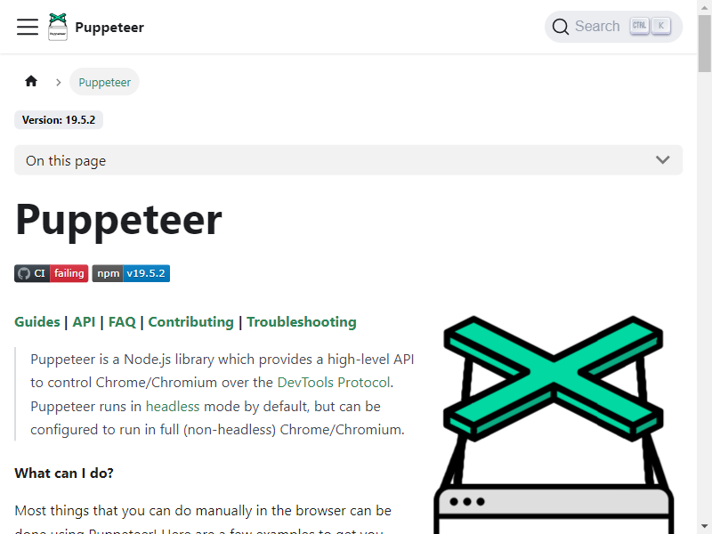

## Puppeteer quick test

  Generate a PDF version of a given web page and capture a screenshot.

  
  
  [Puppeteer website]([#puppeteer-quick-test](https://pptr.dev/))

## Table of Contents

- [Puppeteer quick test](#puppeteer-quick-test)
- [Table of Contents](#table-of-contents)
- [Github repo](#github-repo)
- [Installation](#installation)
- [Usage](#usage)
- [Contributing](#contributing)

 ## Github repo
 https://github.com/alane019/puppeteer-test-01
 ## Installation
  Install nodejs and npm dependencies.

  ## Usage
   Use `npm start` to run the file. 

  ## Contributing
  Submit a pull request to contribute.
